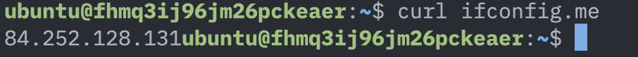
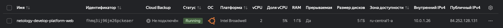
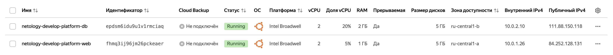
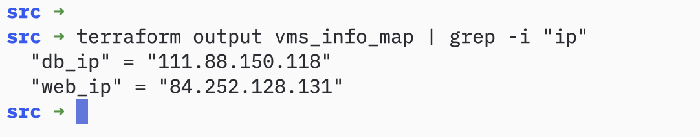
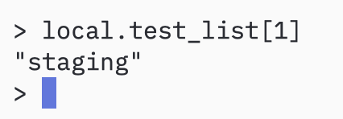
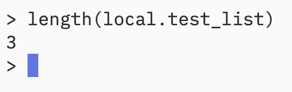
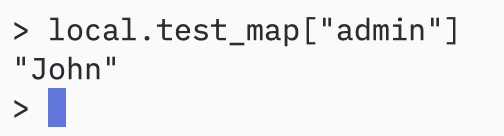
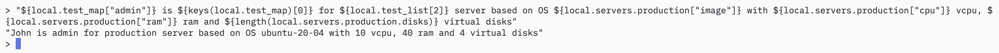
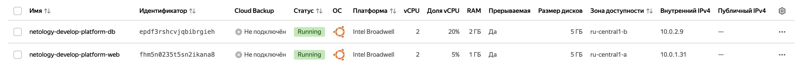
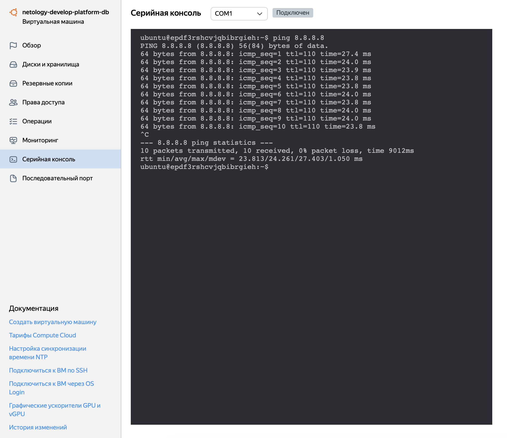

# Домашнее задание к занятию «Основы Terraform. Yandex Cloud» - Муравский Артем

1. Найденные ошибки:
  - `platform_id = "standart-v4"` исправлено standar**t** -> standar**d**, v**4** -> v**1**
  - для ресурса `resource "yandex_compute_instance" "platform"` кол-во ядер CPU не может быть нечетным `cores = 1` -> `cores = 2`
  - для `platform_id = "standart-v1"` значение `core_fraction` может быть равно `5` для других `platform_id` значение начинается с `20`
  
  Как в процессе обучения могут пригодиться параметры `preemptible = true` и `core_fraction=5` в параметрах ВМ? Эти параметры существенно влияют на стоимость аренды виртуальной машины в Yandex Cloud, а именно уменьшают её.
  
  Выполнение команды `curl ifconfig.me` в консоли самой ВМ
  

  Параметры ВМ из веб консоли Yandex Cloud
  

2. [Файл variables.tf](src/variables.tf), сами значения указаны в `terraform.tfvars`

3. Создана вторая ВМ `netology-develop-platform-db`
  

4. [Файл outputs.tf](src/outputs.tf)
  
  Вывод значений ip-адресов командой `terraform output`
  

5. [Файл locals.tf](src/locals.tf)

6. [Файл variables.tf](src/variables.tf) строки 59 - 75

7. Команды выполненные в `terraform console`

  7.1 `local.test_list[1]`
  
  
  7.2 `3`
  
  
  7.3 `local.test_map["admin"]`
  
  
  7.4 `"${local.test_map["admin"]} is ${keys(local.test_map)[0]} for ${local.test_list[2]} server based on OS ${local.servers.production["image"]} with ${local.servers.production["cpu"]} vcpu, ${local.servers.production["ram"]} ram and ${length(local.servers.production.disks)} virtual disks"`
  

8. [Файл variables.tf](src/variables.tf) строки 77 - 89
  Выражение в `terraform console`, которое позволит вычленить строку `“ssh -o ‘StrictHostKeyChecking=no’ ubuntu@62.84.124.117”` из этой переменной - `var.test[0].dev1[0]`

9. [Файл main.tf](src/main.tf) строки 79 - 95
  
  ВМ в веб консоли Yandex Cloud без публичных ip-адресов
  
  
  Пинг внешнего адреса из serial консоли ВМ `netology-develop-platform-web`
  
  
  Пинг внешнего адреса из serial консоли ВМ `netology-develop-platform-db`
  
