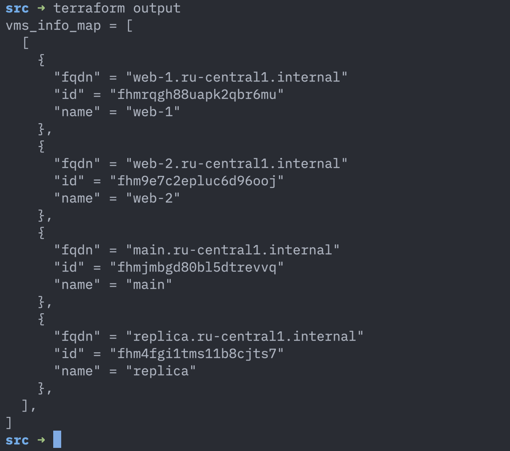
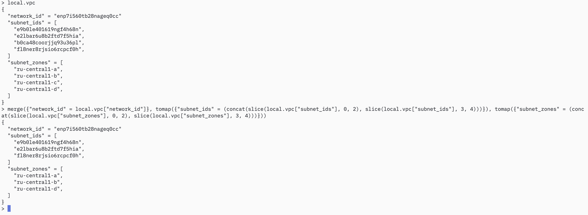

# Домашнее задание к занятию «Управляющие конструкции в коде Terraform» - Муравский Артем

---

1. Скриншоты правил для входящего трафика
  


---

2. Скриншот веб консоли Yandex Cloud с виртуальными машинами созданными с помощью [файла count-vm.tf](src/count-vm.tf) и [файла for_each-vm.tf](src/for_each-vm.tf)


---

3. Скриншот веб консоли Yandex Cloud с дисками, созданными с помощью [файла disk-vm.tf](src/disk-vm.tf) и подключенными к виртуальной машине `storage`, описанной в этом же файле


---

4. [Файл hosts.ini](src/hosts_copy.ini) созданный по условиям задания с помощью [файла-шаблона hosts.tftpl](src/hosts.tftpl)

---

5. Скриншот вывода команды `terraform output`, формируемый с помощью [файла outputs.tf](src/outputs.tf)



---

6. [Файл ansible.tf](src/ansible.tf) строки 14 и ниже

---

7. Выражение для получения требуемого результата: `merge({"network_id" = local.vpc["network_id"]}, tomap({"subnet_ids" = (concat(slice(local.vpc["subnet_ids"], 0, 2), slice(local.vpc["subnet_ids"], 3, 4)))}), tomap({"subnet_zones" = (concat(slice(local.vpc["subnet_zones"], 0, 2), slice(local.vpc["subnet_zones"], 3, 4)))}))`

  

---

8. В этом файле не правильно используется интерполяция: переменной `ansible_host` присваивается (заключается в фигурные скобки) все выражение `${i["network_interface"][0]["nat_ip_address"] platform_id=${i["platform_id "]}}`. Хотя здесь явно просматривается переменная `platform_id`, которой должно быть присвоено свое значение. Исправление будет заключаться просто в переносе закрывающей фигурной скобки.

  Исправленный фрагмент файла
  ```
  [webservers]
  %{~ for i in webservers ~}
  ${i["name"]} ansible_host=${i["network_interface"][0]["nat_ip_address"]} platform_id=${i["platform_id "]}
  %{~ endfor ~}
  ```

---

9.1 Получился такой вариант: `concat(formatlist("rc0%s", range(1, 10)), formatlist("rc%s", range(10, 100)))`

9.2 Первоначально получилось: `concat(formatlist("rc0%s", range(1, 7)), formatlist("rc%s", range(11, 17)), formatlist("rc%s", range(19, 20)), formatlist("rc%s", range(21, 27)), formatlist("rc%s", range(31, 37)), formatlist("rc%s", range(41, 47)), formatlist("rc%s", range(51, 57)), formatlist("rc%s", range(61, 67)), formatlist("rc%s", range(71, 77)), formatlist("rc%s", range(81, 87)), formatlist("rc%s", range(91, 97)))`
  
Еще вариант: `sort(concat(formatlist("rc0%s", range(1, 7)), formatlist("rc%s", range(11, 101, 10)), formatlist("rc%s", range(12, 102, 10)), formatlist("rc%s", range(13, 103, 10)), formatlist("rc%s", range(14, 104, 10)), formatlist("rc%s", range(15, 105, 10)), formatlist("rc%s", range(16, 106, 10)), formatlist("rc%s", range(19, 20))))`
