# Домашнее задание к занятию «Продвинутые методы работы с Terraform» - Муравский Артем

---

1. Скриншот страницы веб консоли Yandex Cloud с созданными ВМ с помощью remote-модуля

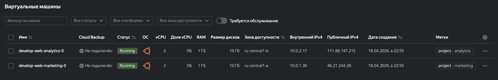

Скриншоты вывода команды `module.analytics_vm` в `terraform console`

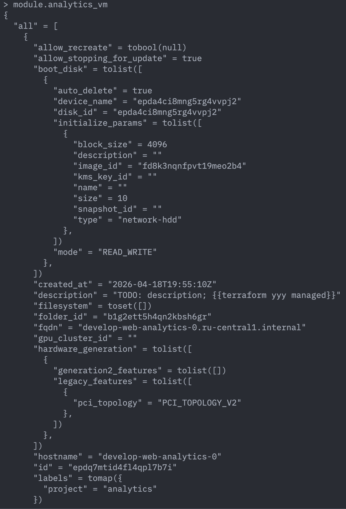

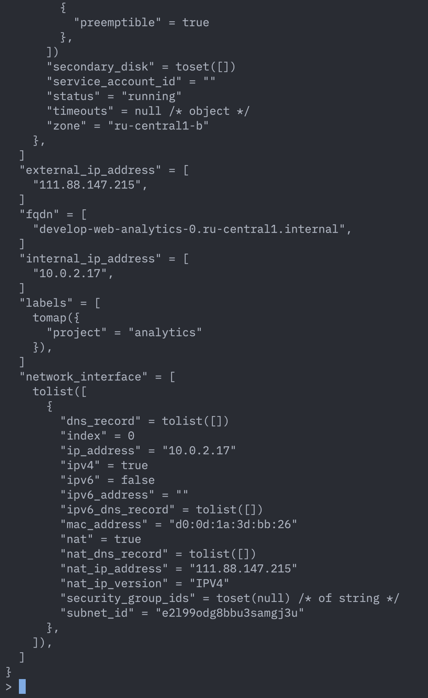

Скриншоты вывода команды `sudo nginx -t` в консоли ВМ

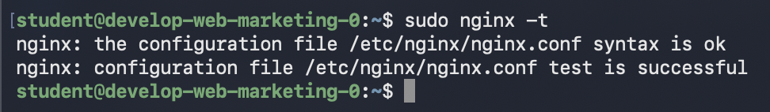

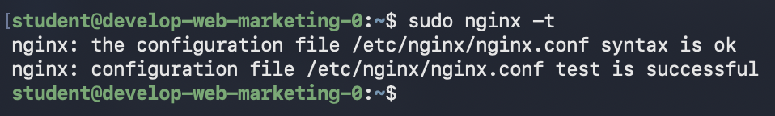

---

2. [Файл с документацией модуля vpc](src/vpc/DOC.md)

Скриншот вывода команды `module.project_vpc` в `terraform console`

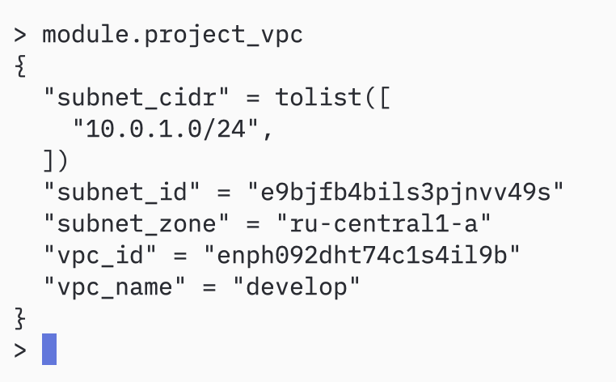

---

3. Просмотр ресурсов, которые находятся в terraform state выполняется с помощью команды `terraform state list`

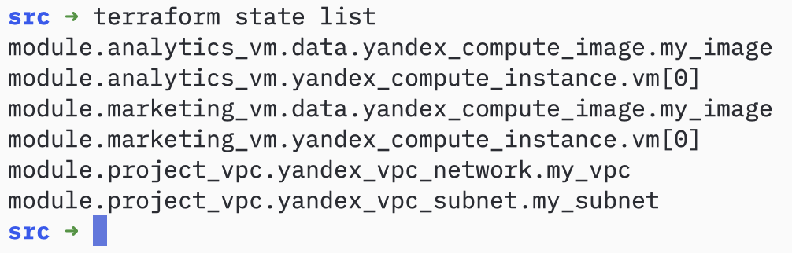

Удаление ресурсов в terraform state (но не самого ресурса в облаке!) выполняется с помощью команды `terraform rm '<resource>'`
Скриншот удаления ресурса `project_vpc` из terraform state

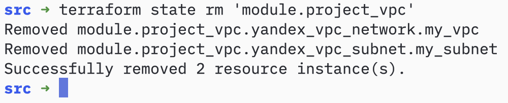

Скриншот удаления ресурсов `marketing_vm` и `analytics_vm` из terraform state

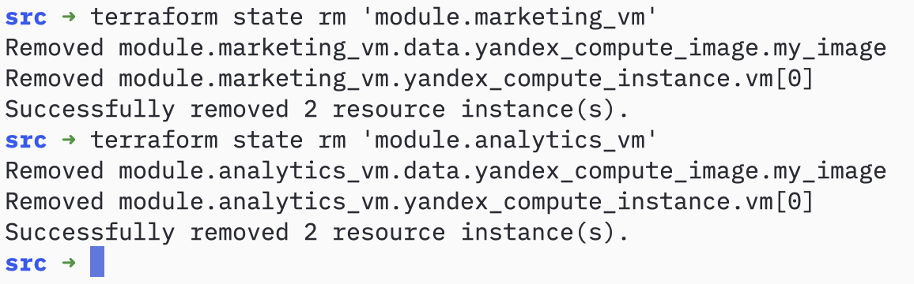

Импорт ресурсов в terraform state выполняется с помощью команды `terraform import '<resource>' id`, значение `id` у ресурсов Yandex Cloud можно узнать в веб консоли

Скриншоты импорта ресурсов `module.project_vpc.yandex_vpc_network.my_vpc` и `module.project_vpc.yandex_vpc_subnet.my_subnet`

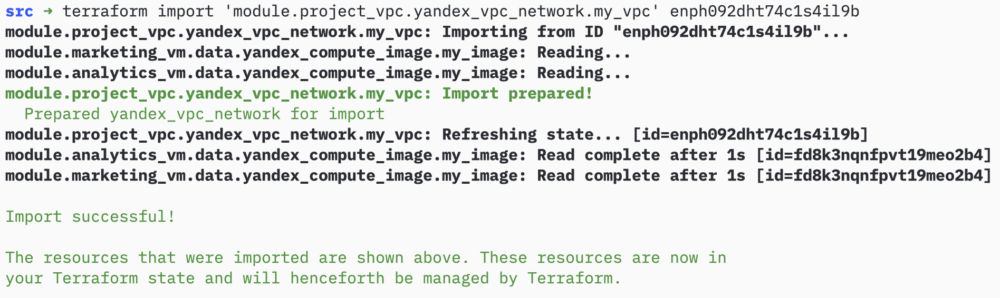

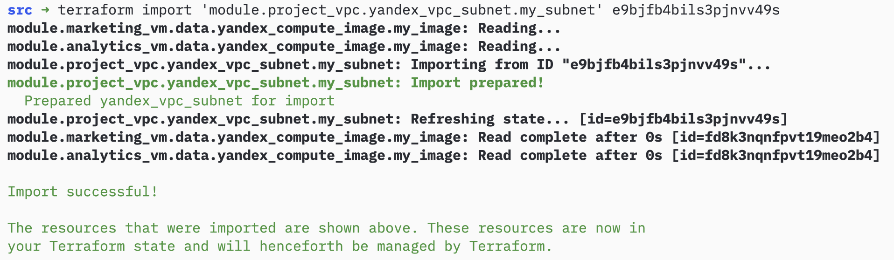

Скриншот импорта ресурсов `module.marketing_vm.yandex_compute_instance.vm[0]` и `module.analytics_vm.yandex_compute_instance.vm[0]`

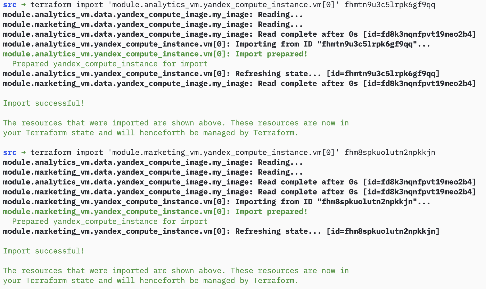

Скриншот выполнения команды `terraform plan` после импорта ресурсов

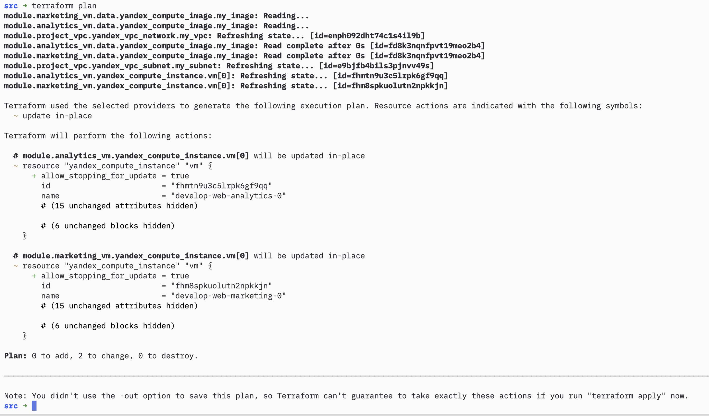

---

4. [Модуль vpc](src/vpc)

Скриншот вывода команды `module.project_vpc` в `terraform console`

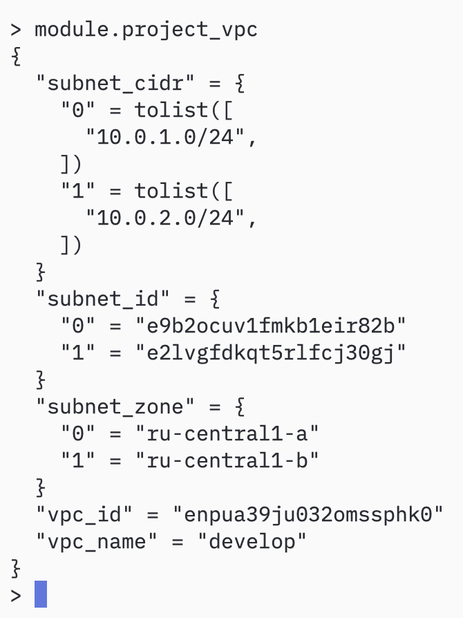

Скриншот страницы веб консоли Yandex Cloud с подсетями созданных модулем vpc 

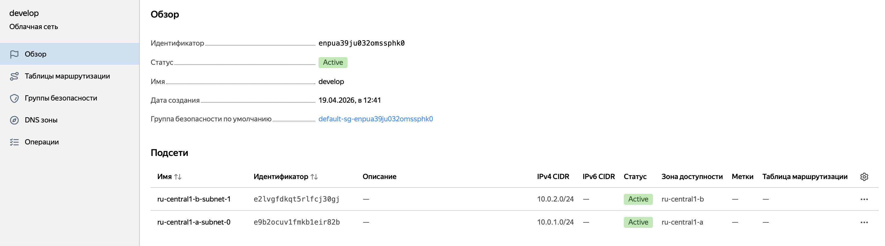

---

5. [Модуль создания MySQL кластера](src/db)

Скриншоты веб консоли Yandex Cloud с созданным MySQL кластером (не HA)

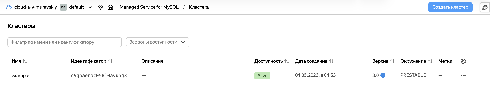

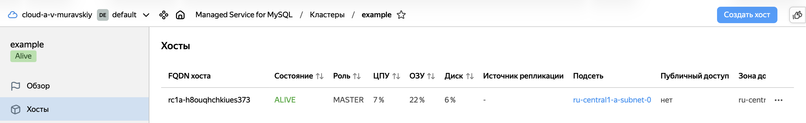

[Модуль создания базы данных и пользователя](src/create_db)

Скриншот веб консоли Yandex Cloud с созданной базой данных `test` в MySQL кластере

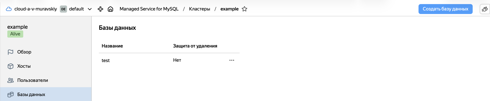

Скриншот веб консоли Yandex Cloud с созданным пользователем `app` в MySQL кластере

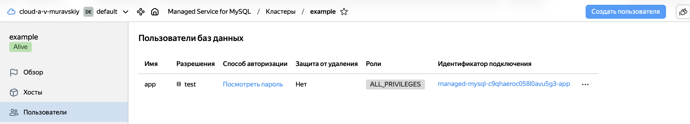

Скриншоты веб консоли Yandex Cloud после установления флага `ha = true` (создан дополнительный хост в кластере)

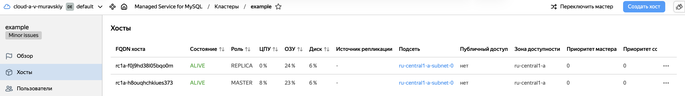

---

6. Скриншот веб консоли Yandex Cloud с созданным S3 бакетом

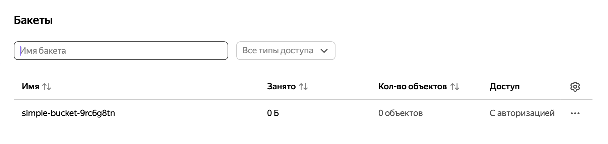

---

7. Скриншот вывода значения секрета из HashiCorp Vault (команда `nonsensitive(data.vault_generic_secret.vault_example.data.test)`, выполненная в `terraform console`)

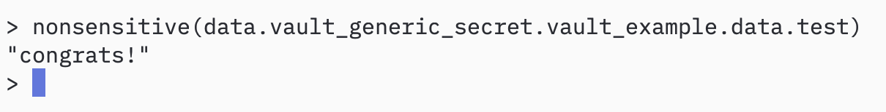

Скриншот значения секрета, записанного в HashiCorp Vault с помощью Terraform

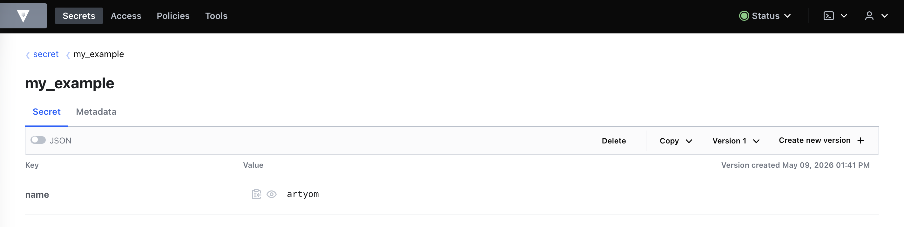

---

8. [VPC root-модуль](src/vpc), чтение из его `terraform.tfstate` выходных переменных в [main.tf](src/main.tf) строки 108-114 и далее использование этих переменных в модулях создания ВМ
