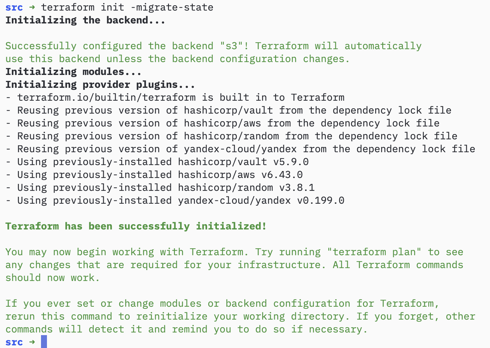
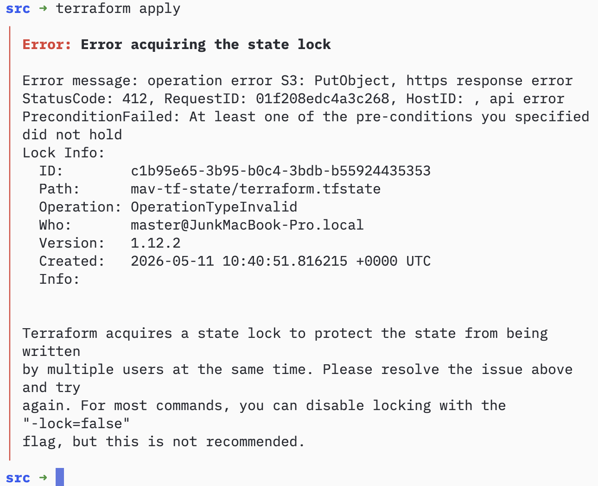
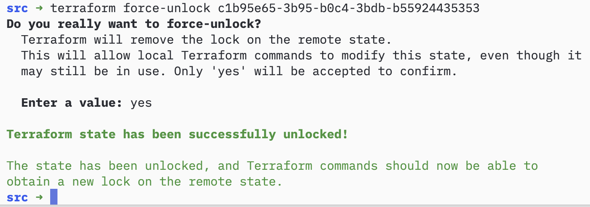

# Домашнее задание к занятию «Использование Terraform в команде» - Муравский Артем

---

1. При проверке кода с помощью `tflint` (выполнении команды `docker run --rm -v "$(pwd):/tflint" ghcr.io/terraform-linters/tflint --chdir=/tflint`), видим следующие типы ошибок (предупреждений):
  - `Warning: Module source "git::https://github.com/udjin10/yandex_compute_instance.git?ref=main" uses a default branch as ref (main) (terraform_module_pinned_source)` - ссылка на модуль из Git-репозитория через ветку main (или master), ветка по умолчанию может меняться со временем (например, разработчик модуля обновит main), и тогда инфраструктура неожиданно получит новую версию модуля. Это делает конфигурацию недетерминированной. Исправление: указать конкретный тег или коммит

  - `Warning: Module source "git::https://github.com/terraform-yc-modules/terraform-yc-s3" is not pinned (terraform_module_pinned_source)` - в ссылке на модуль полностью отсутствует ?ref=.... Без фиксации версии Terraform всегда будет использовать последний коммит ветки по умолчанию (обычно main или master). Это ещё менее надёжно, чем использование main (потому что даже ветка по умолчанию не указана явно — она может измениться в репозитории). Исправление: добавить ?ref=... с конкретным тегом, веткой или хэшем коммита

  - `Warning: Missing version constraint for provider "yandex" in `required_providers` (terraform_required_providers)` - в блоке terraform { required_providers { ... } } для провайдера yandex не указана версия. Без версии Terraform скачает самую последнюю версию провайдера при каждом init. Это может привести к несовместимости или неожиданному поведению при обновлении. Исправление: добавить явную версию провайдера в required_providers

  - `Warning: [Fixable] variable "vm_web_name" is declared but not used (terraform_unused_declarations)` - объявлена переменная (input variable) vm_web_name, но нигде в конфигурации (в ресурсах, модулях, output, locals) она не используется. Такие переменные создают шум в коде и могут вводить в заблуждение. Исправление: удалить переменную или использовать её в конфигурации

При выполнении кода с помощью `checkov` (командой `docker run --rm --tty --volume $(pwd):/tf --workdir /tf bridgecrew/checkov --download-external-modules true --directory /tf`), видим следующие типы ошибок (предупреждений):
  - `CKV_SECRET_6: "Base64 High Entropy String"` - обнаружена строка, похожая на секрет (высокая энтропия, base64-подобная). Исправление: удалить токен из кода, использовать переменные окружения, terraform.tfvars (игнорируемый .gitignore), или секреты типа Yandex Lockbox / Vault.
  - `CKV_TF_2: "Ensure Terraform module sources use a tag with a version number"` - лучше использовать теги с версиями (например ?ref=v1.2.3), а не ветки. Это более читаемо, чем хэш. Исправление: использовать теги с версиями вместо веток.
  - `CKV_TF_1: "Ensure Terraform module sources use a commit hash"` - при использовании Git-репозитория в source модуля нужно указывать конкретный hash коммита, а не ветку (ref=main). Исправление: использовать теги с версиями вместо веток.
  - `CKV_YC_1: "Ensure security group is assigned to database cluster."` - к кластеру базы данных (MySQL, Postgres) должна быть привязана security group. Исправление: привязать security group к кластеру базы данных.
  - `CKV_YC_11: "Ensure security group is assigned to network interface."` - к сетевому интерфейсу ВМ должна быть привязана группа безопасности (security group). Исправление: привязать security group к сетевому интерфейсу.
  - `CKV_YC_2: "Ensure compute instance does not have public IP."` - ВМ в Yandex Cloud не должна иметь публичный IP-адрес (если это не строго необходимо). Исправление: удалить публичный IP-адрес из конфигурации ВМ.

---

2. Скриншот выполнения команды `terraform init -migrate-state`

Скриншот выполнения команды `terraform apply` при предварительно выполненной команде `terraform console`

Скриншот ручной разблокировки состояния командой `terraform force-unlock <lock_id>`

